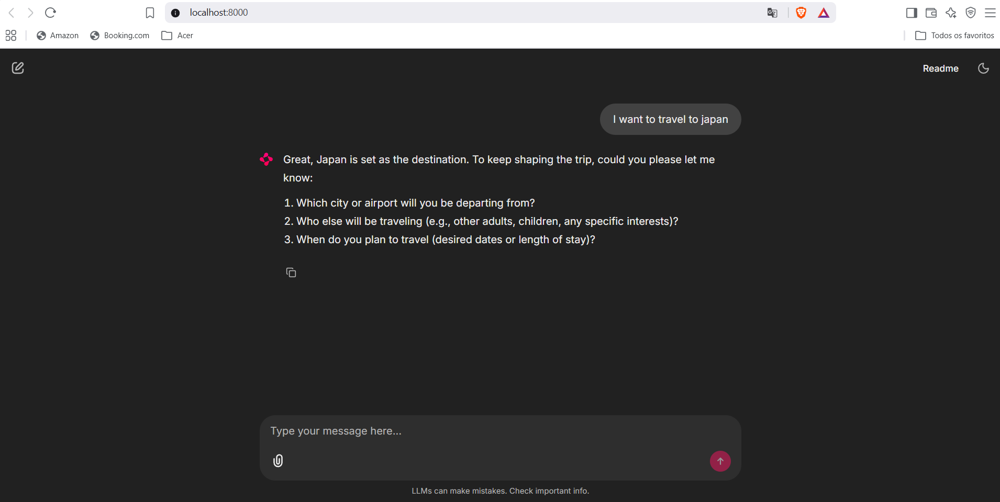

# Travel Agent

A multi-agent trip planner built on [Google ADK](https://google.github.io/adk-docs/). It takes a trip from a chat interview to a day-by-day, budgeted itinerary, routing between three phases purely from state. No LLM ever decides what happens next; that call is made in plain code.

## How it works

A trip goes through three phases, always in this order:

```
coordinator (plain code router, no LLM of its own)
  │
  ├─ 1. intake_agent        (conversational) → state["brief"]
  ├─ 2. research_pipeline   (headless)        → state["research"]
  └─ 3. planning_pipeline   (headless)        → state["plan"]
```

`coordinator` ([agent.py](agent.py)) is a plain `BaseAgent`, not an `LlmAgent`: it has no `transfer_to_agent` tool and never "decides" anything. Every user turn re-enters it, and it inspects `session.state` to work out which phase(s) need to run, based only on `brief.status` and version numbers. Edit the confirmed brief later and bump its `version`, and research and planning just re-run on the next turn.

### Phase 1: Intake (`intake_agent`)

The only phase with a human in the loop. Runs a discovery interview and fills out a `TripBrief` ([sub_agents/intake_agent/trip_brief.py](sub_agents/intake_agent/trip_brief.py)): travelers, origin, destinations, dates, budget, pace, preferences. Asks at most 3 questions per turn, runs a deterministic feasibility check (budget vs. scope, cities vs. nights, visa lead time) as soon as enough fields are known, and only offers final confirmation once nothing required is missing.

Two helper agents get called as tools here, never talked to directly by the user. `brainstorm_agent` is `google_search`-grounded and suggests destination candidates when the traveler has no place in mind yet. `negotiator_agent` takes an "infeasible" verdict's raw conflicts and turns them into 2-3 concrete, natural-language relaxation options.

Confirming the brief (`status: "confirmed"`) is the only thing that hands off the trip: the coordinator notices it and starts research immediately, in the same turn.

### Phase 2: Research (`research_pipeline`)

Headless, no user in the loop. Turns the confirmed brief into a `ResearchPack` ([sub_agents/research_pipeline/research_pack.py](sub_agents/research_pipeline/research_pack.py)):

1. `base_resolver` resolves the brief's destinations, which may be country/region-level (e.g. "Japan"), into real city-level `stops` with a night count each.
2. Five scouts run in parallel, each `google_search`-grounded: `poi_scout` runs one discovery call per resolved city, geocoded afterward in plain code, while `season_scout`, `logistics_scout`, `entry_scout`, and `cost_scout` cover climate/warnings, transport, visa/entry requirements, and cost anchors (flight, lodging, meals, transit).
3. `poi_coverage_retry` runs one more code-only top-up round for any city that came back short on validated points of interest.
4. `aggregator`, pure code again, assembles everything into `state["research"]`.

### Phase 3: Planning (`planning_pipeline`)

Headless and sequential. Turns the `ResearchPack` into a concrete `TripPlan` ([sub_agents/planning_pipeline/trip_plan.py](sub_agents/planning_pipeline/trip_plan.py)):

1. `selection`: code computes how many POIs fit (nights × pace), then an LLM decides *which* ones, with `must`-priority attractions always included regardless of the count.
2. `geo_clustering`: pure code, k-means on POI coordinates, one cluster per day per city. This is what stops a day from zig-zagging across town.
3. `day_distribution_agent`: LLM, orders each day's fixed cluster into morning/afternoon/evening blocks and handles closed-weekday conflicts.
4. `lodging_transport_agent`: LLM, recommends one lodging area per city plus the transport legs between them.
5. `plan_assembler`: pure code again, sums the budget from cost anchors and ticket prices into the final `TripPlan`.
6. `plan_presenter`: LLM, the only step whose output is meant for the user. It writes the final Markdown itinerary.

Every LLM step in phases 2 and 3 only ever decides *which* or *how*, never *how many* or *what's near what*. Those are resolved in plain code first and handed down as fixed constraints.

## Requirements

- Python ≥ 3.12
- Dependencies declared in the repo root [pyproject.toml](../pyproject.toml) (managed with [uv](https://docs.astral.sh/uv/)): `google-adk`, `google-cloud-logging`, `litellm`, `python-dotenv`, plus a couple of tool-related extras.
- An **OpenRouter** API key (chat models: intake, negotiator, day distribution, lodging/transport, plan presenter, selection).
- A **Google AI (Gemini)** API key or Vertex AI access, for every agent using the built-in `google_search` tool (brainstorm, base resolver, POI discovery, and the season/logistics/entry/cost scouts). `google_search` only works against a real Gemini backend, not through the OpenRouter/LiteLLM path.
- A **Google Maps Geocoding API** key (validates and geocodes POIs for clustering).
- Google Cloud Logging credentials: `google.cloud.logging.Client()` gets constructed on import and needs valid credentials even though the chat models themselves go through OpenRouter.

## Setup

From the repository root (`adk_agents/`):

```bash
# Install dependencies (uv, using the committed lockfile)
uv sync

# or with plain pip
pip install -r requirements.txt -e .

# Copy the env template and fill in your keys
cp .env.example .env
```

> Note: there's also a `.env.example` inside `travel_agent/` with the same variables. Keep whichever one you actually use as `.env` in sync: ADK loads it relative to the working directory you launch from.

## Environment variables

| Variable | Required | Description |
|---|---|---|
| `OPENROUTER_API_KEY` | Yes | Key from [openrouter.ai/keys](https://openrouter.ai/keys). Used by every chat-model agent (intake, negotiator, day distribution, lodging/transport, plan presenter, selection). |
| `MODEL` | Yes | OpenRouter model slug, e.g. `anthropic/claude-sonnet-4.5`. The code prefixes it with `openrouter/` automatically, so don't include that prefix yourself. |
| `OPENROUTER_API_BASE` | No | OpenRouter endpoint. Default: `https://openrouter.ai/api/v1`. Only change it if routing through your own proxy/gateway. |
| `GOOGLE_CLOUD_PROJECT` | Yes | GCP project ID for Google Cloud Logging (constructed on import). |
| `GOOGLE_APPLICATION_CREDENTIALS` | Yes* | Path to a service-account JSON key with Logging permissions. *Not needed if you're using Application Default Credentials instead (e.g. `gcloud auth application-default login`). |
| `GOOGLE_API_KEY` | Yes | Gemini API key for every `google_search`-grounded agent (brainstorm, base resolver, POI discovery, season/logistics/entry/cost scouts). Alternative: authenticate via Vertex AI instead (see below). |
| `GOOGLE_SEARCH_MODEL` | No | Gemini model id used for search-grounded agents. Default: `gemini-2.5-flash`. |
| `GOOGLE_MAPS_API_KEY` | Yes | Key from the [Google Maps Platform console](https://console.cloud.google.com/google/maps-apis) with the **Geocoding API** enabled and billing active. Used to validate/geocode every discovered POI. |
| `GOOGLE_GENAI_USE_VERTEXAI` | No | Set to `TRUE` to authenticate `google_search` agents via Vertex AI instead of `GOOGLE_API_KEY`. Requires `GOOGLE_CLOUD_PROJECT`/`GOOGLE_CLOUD_LOCATION` to also be set. |

## Running

From the repository root, with `.env` populated:

```bash
# Web UI (chat + state/event inspector) - pick "travel_agent" from the dropdown
adk web

# Terminal chat
adk run travel_agent

# HTTP API server
adk api_server
```

A typical session: chat with `intake_agent` until the brief is confirmed, then watch `research_pipeline` and `planning_pipeline` run automatically in the same turn. The final message you see is the Markdown itinerary from `plan_presenter`.

## Consuming the deployed agent

Once `travel_agent` has been deployed with `adk deploy agent_engine`, it lives as a Vertex AI Agent Engine (Reasoning Engine) resource — `adk web`/`adk run` no longer apply, since those run the agent locally. A small [Chainlit](https://docs.chainlit.io/) chat client for the remote deployment lives in [`client/`](../client/):

```bash
# From the repository root
uv sync --extra client
cp client/.env.example client/.env   # fill in project, location, and the resource name printed by the deploy command
uv run chainlit run client/app.py -w
```

Open `http://localhost:8000` and chat as usual — the client authenticates with your Application Default Credentials (the same `gcloud auth application-default login` used for the deploy), creates one remote session per browser chat, and streams back each sub-agent's response (`intake_agent`, then `research_pipeline`/`planning_pipeline`'s `plan_presenter`) as it arrives.



## Example interaction

A full run, start to finish. The first few turns are the only part with a human in the loop; everything after "confirmed" happens headless, in the same turn, and the last message is what `plan_presenter` writes.

**You:** Hey, I want to plan a trip to Portugal for me and my girlfriend, sometime in June, around 8 nights. We don't have a huge budget, maybe $2500 total, not counting flights.

**intake_agent:** Portugal, 8 nights in June, $2500 excluding flights, got it. A few things before I can check if that's realistic:
1. Where are you flying out from, city and airport if you know it?
2. I'll need you both as separate traveler profiles. Any interests, dietary restrictions, or deal-breakers I should note for either of you?
3. Any particular things you already want to do there, or is this open?

**You:** We're flying out of Boston, BOS. I like history and good food, she's really into photography and hiking. No dietary issues. Nothing specific planned yet.

*(`update_brief` saves `origin`, two `travelers` entries, and their `interests`. `hard.nights`, `hard.budget_ceiling`, and `hard.date_window.season_hint` were already set from turn one, so `run_feasibility_check` fires now: 8 nights × 2 travelers × $150/day ≈ $2,400 against a $2,500 ceiling. That clears the ceiling, so the verdict comes back `feasible`, not `tight`.)*

**intake_agent:** Good news, that budget works, though it's close: our rough estimate lands around $2,400 of your $2,500 before flights. Two more optional things: any lodging style you lean toward (hotel, airbnb, guesthouse), and should I let the research phase pick attractions, or do you already have a short list?

**You:** Boutique hotels or nice airbnbs in central areas. And sure, let research suggest things, we don't have a list.

*(Lodging style saved; "attractions" recorded in `declined` so it stops reappearing in `missing_recommended`.)*

**intake_agent:** Last couple of things: what's your food style, street food and markets, or sit-down restaurants? And pace-wise, relaxed with lots of downtime, or do you want to pack the days?

**You:** Street food and local spots, nothing fancy. Balanced pace, we don't want to rush, but this is our first big trip together so we do want to actually see things.

**intake_agent:** Here's the brief: Portugal, 8 nights in June, flying from Boston (BOS), two travelers, $2,500 budget before flights, balanced pace, boutique hotel or central airbnb, street food over fine dining, no must-see list, research picks the attractions. Feasibility check came back fine. Confirm and I'll start research and planning right after this.

**You:** Yes, let's do it!

*(`brief.status` flips to `confirmed`. `coordinator` catches that on this same turn and runs `research_pipeline` next: `base_resolver` splits Portugal into two real stops, Lisbon (5 nights) and Porto (3 nights), and the five scouts research POIs, season, transport, entry requirements, and cost anchors for both. `planning_pipeline` then selects POIs, clusters them by day, orders each day, picks lodging areas, and totals the budget. Nothing here needed another message from you; the next reply is the finished plan.)*

**plan_presenter:**

```markdown
## Your Portugal trip: 8 nights, Lisbon + Porto

### Lisbon (Days 1-5)

**Day 1**
- Morning: Belém Tower (90 min)
- Morning: Jerónimos Monastery (75 min)
- Afternoon: Alfama neighborhood walk (120 min)
- Evening: Time Out Market, dinner (90 min)

**Day 2**
- Morning: LX Factory (100 min)
- Afternoon: Gulbenkian Museum (120 min)
- Evening: Bairro Alto food crawl (120 min)

*(Days 3-5 omitted here; the real output lists all of them.)*

### Porto (Days 6-8)

**Day 6**
- Morning: Livraria Lello (60 min)
- Afternoon: Ribeira riverside walk (90 min)
- Evening: Port wine cellar tour, Vila Nova de Gaia (90 min)

*(Days 7-8 omitted here.)*

### Lodging

- Lisbon: Chiado, boutique hotel, roughly €110/night, closest to four of the five day clusters.
- Porto: Ribeira, guesthouse, roughly €85/night, walking distance to the riverside.

### Transport

- Lisbon → Porto: train (Alfa Pendular), about 2h45.

### Budget

| Category | Range (USD) |
|---|---|
| Flights | $1,300 - $1,800 |
| Lodging | $720 - $1,120 |
| Food | $384 - $800 |
| Local transit | $128 - $240 |
| Activities | $60 - $95 |
| **Total** | **$2,592 - $4,055** |

Budget assumes one room for the two of you and two paid meals/person/day. The total above includes flights; your $2,500 figure didn't, so lodging, food, transit, and activities alone land close to it.
```

*(Numbers here are illustrative; a real run pulls live prices and availability through `google_search` and the Geocoding API at the time it runs.)*

## State contracts

The three phases communicate only through `session.state`, each keyed by its own versioned schema:

- `state["brief"]` is a `TripBrief` (`sub_agents/intake_agent/trip_brief.py`), with a `version` that increments on user-accepted revisions.
- `state["research"]` is a `ResearchPack` (`sub_agents/research_pipeline/research_pack.py`). It carries `brief_version` and goes stale once the brief moves on.
- `state["plan"]` is a `TripPlan` (`sub_agents/planning_pipeline/trip_plan.py`). Same deal: `brief_version` and `pack_id` decide staleness.

Whenever `brief.version` changes, `coordinator` notices `research`/`plan` no longer match and re-runs the downstream phases on the next turn. Nothing needs to be triggered manually.
